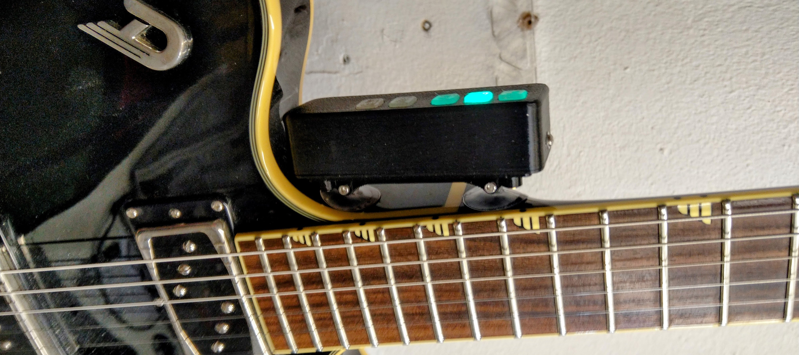
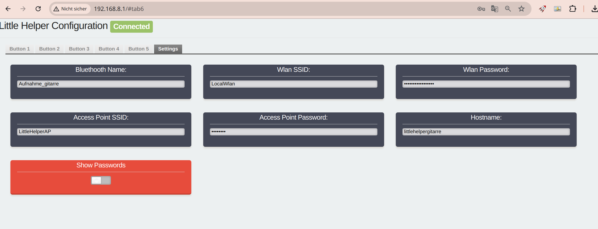
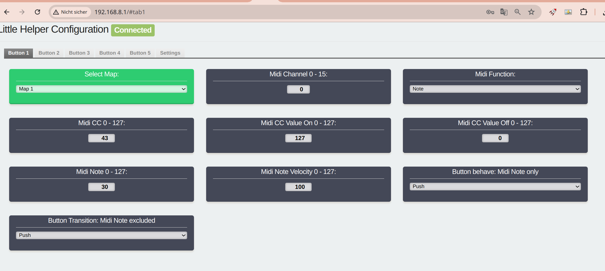

# Minimal ESP32 BLE Midi Control Interface

This project is a minimal ESP32 BLE MIDI controller. It allows you to control MIDI devices wirelessly using Bluetooth Low Energy (BLE) technology. The controller is designed to be compact and easy to use, making it ideal for musicians and performers.



## Features

- BLE MIDI connectivity
- Compact and portable design
- Easy-to-use interface
- Easy-to-use Web UI to make settings
- Online Firmware Update
- With Ardour and Harrison Mixbus compatible midi_map file
- as Platformio Project (esp32 arduino framework)

## Parts
- ESP32-S3-Mini
- 5 momentary button switches
- 5 10k resistors
- breadboard
- optional rgb led ws28xx

## PCB Version with Lipo and Battery Charger

PCB:


Housing:


## Getting Started

To get started with the project, follow these steps:

1. Clone the repository: `$ git clone https://github.com/wolkstein/minimal-esp32-ble-midi-ctrl`
2. Open as Platformio Project for example with VSC Pio Extension
3. Connect your ESP32 device to your computer via USB.
4. Change the platformio.ini as you need
5. Press PIO upload button
6. Your ESP32 BLE MIDI controller is now ready to use!

## Contributing

Contributions are welcome! If you have any ideas, suggestions, or bug reports, please open an issue or submit a pull request.

## License

This project is licensed under the GNU General Public License v3.0. See the [LICENSE](LICENSE) file for more information.

## Linux howto BlueZ with MIDI over BLE Support

Nice Howto from Peter P:

https://tttapa.github.io/Pages/Ubuntu/Software-Installation/BlueZ.html

After compiling BlueZ, Little Helper shown in Catja App


## Ardour / Mixbus Midi Setup

- For example copy the Midi Map file from this Repo like this:
```bash
cp DAW_MIDI_MAPS/ArdourAndHarrisonMixbus/midi_mapsLittle_Helper.map ~/.config/ardour6/midi_maps
```
- Now you can open the Edit-Preferences Window in Ardour, and under Control Surfaces, select Generic Midi
- Press Show Protocol Settings
- Now you can select "Little_Helper" in Midi Bindings dropdown
- if Little Helper is already connected via bluetooth you can make connection in Incoming Midi Dropdown like in the Image below
- Done  


---
## Some more pictures of how it is used

### All parts


### Guitar attachment


### Web interface




---
## Simple Manuel

### First Wifi Connection and Settings

#### To connect to Build in access point, follow these steps:

1. Power on your ESP32 BLE MIDI controller while pressing Btn 4 and 5
2. Wait til LED becomes Blue
3. Once initialized, the controller will start broadcasting its own access point (AP) named "LittleHelperAP-xxx"
4. On your computer or mobile device, go to the Wi-Fi settings and connect to the "LittleHelperAP-xxx" network.
5. Open a web browser and enter the following URL: `http://192.168.8.1`.
6. You will be redirected to the controller's web interface.
7. In the web interface, navigate to the "Settings" Tab.


After completing the initial steps, the device is now capable of connecting to a local network. If the user desires, they can hold down buttons 4 and 5 while powering down the device. This will allow the device to connect to a local Wi-Fi network and start the web UI for making MIDI settings, if necessary.

## Firmware Update over WiFi Connection

To update the firmware of your ESP32 BLE MIDI controller over a WiFi connection, follow these steps:

1. Ensure that your ESP32 BLE MIDI controller is connected to your local WiFi network. You can do this by navigating to the "Settings" tab in the controller's web interface and entering your WiFi credentials.

2. Once connected, go to the Settings Tab and check the label that displays the current firmware version (e.g., s3miniVx).

3. Visit the GitHub project page for Little Helper and go to the "Binary" folder (https://github.com/wolkstein/minimal-esp32-ble-midi-ctrl/tree/main/bin) to check if there is a newer firmware available. Look for a firmware version number that is higher than the one displayed in the firmware label.

4. If a newer firmware is available, you can proceed with the update.

5. In the Settings Tab, click the "Try Update" button to request the firmware update.

6. After clicking the button, you will see a message saying "Update Requested, need Reboot".

7. Turn off the power to your ESP32 BLE MIDI controller by switching the power switch to the "off" position and removing the USB cable.

8. Power on the device again either by switching the power switch back on or by connecting the USB cable.

9. Wait for the LED on the device to turn yellow. This indicates that the device is in update mode and is connected to your local network.

10. If the LED starts blinking purple, it means that the update process is running. Wait until the LED switches back to its normal red or green light. If the LED does not blink purple, it means that the device has rebooted without performing the update.

11. If the update fails, you can simply try again. If something goes wrong during the update, the previous firmware will be automatically recovered.

12. If the update is successful, you can reconnect to the web interface and check the firmware version label to confirm the update.

---
# Button Combinations at Power up

This section describes the button combinations and their corresponding functions that can be used during power up.
Btn 1 to btn 5 from left to right.

| Button Combination | Function                                                  |
| ----------------- | --------------------------------------------------------- |
| o o o x x         | Connect To Local Wifi Network and enable Web UI            |
| o o x x x         | Start AP Mode and enable Web UI                            |
| x x o o o         | Reset Midi Settings to Default                            |
| x o x o o         | Reset Midi Settings and Wifi Settings to Default          |

x = pressed,
o = released


