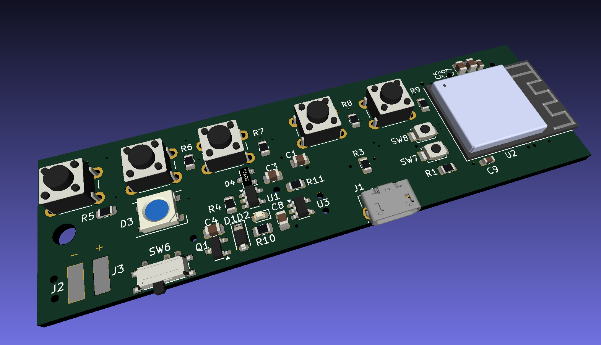

# Minimal ESP32 BLE Midi Control Interface

This project is a minimal ESP32 BLE MIDI controller. It allows you to control MIDI devices wirelessly using Bluetooth Low Energy (BLE) technology. The controller is designed to be compact and easy to use, making it ideal for musicians and performers.

## Features

- BLE MIDI connectivity
- Compact and portable design
- Easy-to-use interface
- With Ardour and Harrison Mixbus compatible midi_map file
- as Platformio Project (esp32 arduino framework)

## Parts
- ESP32 
- 5 momentary button switches
- 5 10k resistors
- breadboard
- optional rgb led ws28xx

## PCB Version with Lipo and Battery Charger

PCB:




Housing:


## Getting Started

To get started with the project, follow these steps:

1. Clone the repository: `$ git clone https://github.com/wolkstein/minimal-esp32-ble-midi-ctrl`
2. Open as Platformio Project for example with VSC Pio Extension
3. Connect your ESP32 device to your computer via USB.
4. Change the platformio.ini as you need
5. Press PIO upload button
6. Your ESP32 BLE MIDI controller is now ready to use!

## Contributing

Contributions are welcome! If you have any ideas, suggestions, or bug reports, please open an issue or submit a pull request.

## License

This project is licensed under the GNU General Public License v3.0. See the [LICENSE](LICENSE) file for more information.

## Linux howto BlueZ with MIDI over BLE Support

Nice Howto from Peter P:

https://tttapa.github.io/Pages/Ubuntu/Software-Installation/BlueZ.html

After compiling BlueZ, Little Helper shown in Catja App


## Ardour / Mixbus Midi Setup

- For example copy the Midi Map file from this Repo like this:
```bash
cp DAW_MIDI_MAPS/ArdourAndHarrisonMixbus/midi_mapsLittle_Helper.map ~/.config/ardour6/midi_maps
```
- Now you can open the Edit-Preferences Window in Ardour, and under Control Surfaces, select Generic Midi
- Press Show Protocol Settings
- Now you can select "Little_Helper" in Midi Bindings dropdown
- if Little Helper is already connected via bluetooth you can make connection in Incoming Midi Dropdown like in the Image below
- Done  


---
## Some more pictures of how it is used

### All parts


### Guitar attachment


